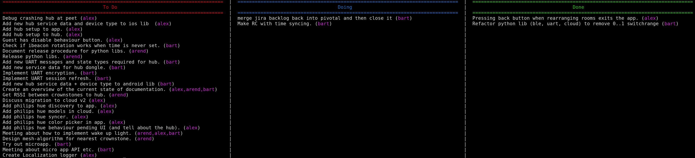

# Board

This uses the pivotal tracker using shell scripts.

Create a `~/.config/pivotal` file with the contents:

```
PIVOTAL_TOKEN=XXX
PIVOTAL_PROJECT=XXX
```

You can now visualize the board like this:

Usage:

```
./get_board.sh
```

Here you find an example of a recent board planning (no secrets spilled here):



You can read more at:

* https://www.pivotaltracker.com/help/api/rest/v5#Iterations

## Copyrights

Crownstone team.


